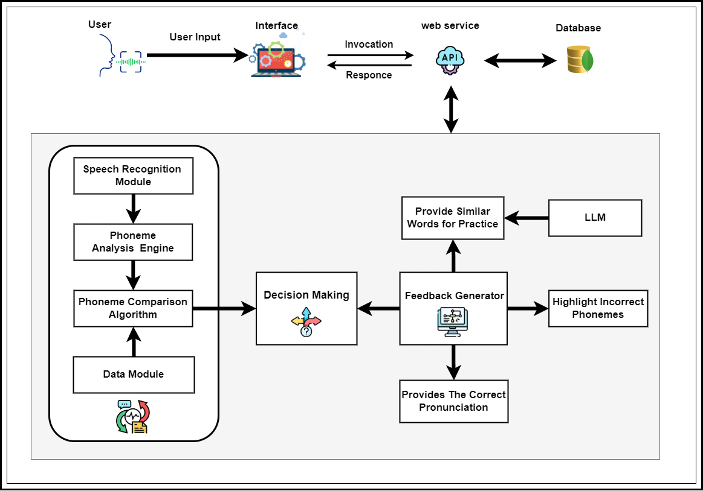
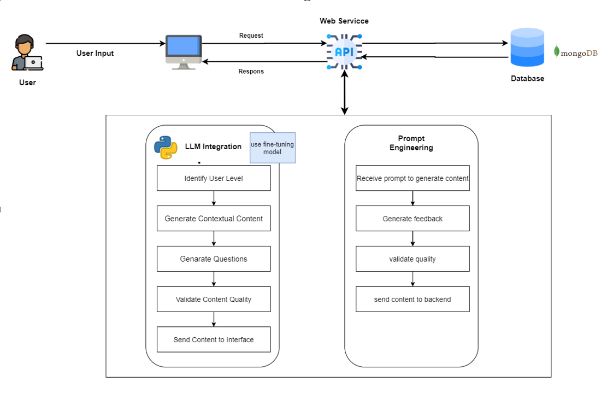
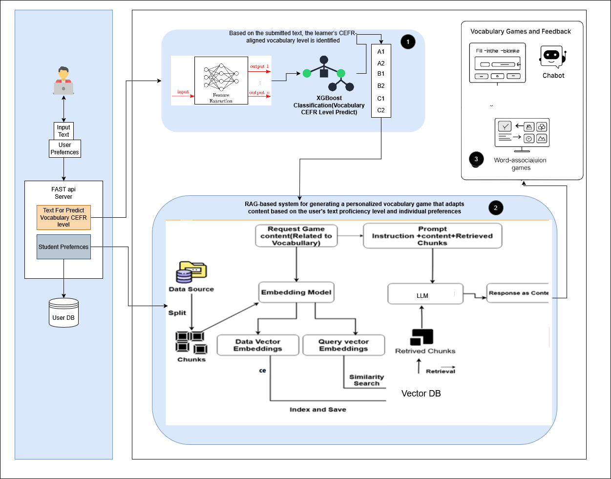

 # AI-enabled-Intelligent-Assistant-to-Improve-Reading-and-Comprehension-Skills-in-English-RP24-25J-027

## Contributors Checklist

### **Ranaweera A.P. - IT21182396 (Group Leader)** 
## Phoneme-Level Speech Error Detection Module

- [ ] Assigned tasks to team members.  
- [ ] Reviewed pull requests and ensured quality code standards.  
- [ ] Maintained project documentation (README, Wiki, etc.).  
- [ ] Led team meetings and discussions.  
- [ ] Ensured deadlines were met.

### **Senanayake W.G.B. - IT21158322**
## System Diagram(Basic Comprehension Skills Enhancemen Module)

- [ ] Developed and tested core backend functionality.  
- [ ] Ensured proper database schema design and implementation.  
- [ ] Created API endpoints and ensured smooth integration.  
- [ ] Handled debugging and resolved technical issues.  
- [ ] Contributed to technical documentation.

### **Sooriyaarachchi M.D.A - IT21173790**  
## System Diagram(AI-Powered Gaming And personalize English Vocabulary Improvement Module)

- [ ] Proficiency Estimation: Developed a CEFR level classifier using NLP and ML to analyze student-submitted text and predict vocabulary proficiency (A1 to C2). 
- [ ] Game Design: Designed and implemented interactive vocabulary games aligned to learner proficiency and interest domains, such as technology, sports, or health.   
- [ ] RAG Integration: Built a RAG-based backend using Pinecone and Lang Chain for real-time semantic retrieval of vocabulary entries. 
- [ ] Content Generation: Leveraged the Gemini LLM to dynamically generate fill-in-the-blank questions, word associations, and MCQs. 
- [ ] Chatbot Development using RAG: Implemented a chatbot for vocabulary support, capable of giving real-time explanations, synonyms, and usage examples.
- [ ] Web Deployment: Developed the full-stack application using React.js, Fast API, and hosted services on Render.com.
- [ ] Software Engineering Practices: Applied microservice architecture for modular deployment, managed version control using Git and GitHub, created Docker containers for each service, implemented CI/CD pipelines for continuous delivery using GitHub Actions, and deployed production-ready services on AWS ECS.
- [ ] Quality Assurance: Integrated Sonar Cloud for static code analysis and quality assurance and wrote automated test cases to ensure reliability and maintainability. 

### **Kumarathunga S.A.D.S - IT21118340**  

#### Project Completion by Progress Presentation 01 (2024-12-04)
- Prompt Engineering
- Selecting Methodology: AI Agent vs RAG vs Agentic
- AI Agent
	* Selecting LLM Model & Inference Engine: Phi3, Ollama
 	* Selecting Architecture & Patterns: ReAct, Tool Calling
- RAG Workflow
	* Selecting Embedding Model & Vector DB: Ollama, ChromaDB
 	* Embedding Creation Pipeline
 	* Corrective RAG
- Frontend Interface Design

<h3>Contributors:</h3>

- Ranaweera A.P. - IT21182396 (Group Leader)
- Senanayake W.G.B. - IT21158322
- Sooriyaarachchi M.D.A - IT21173790
- Kumarathunga S.A.D.S - IT21118340
