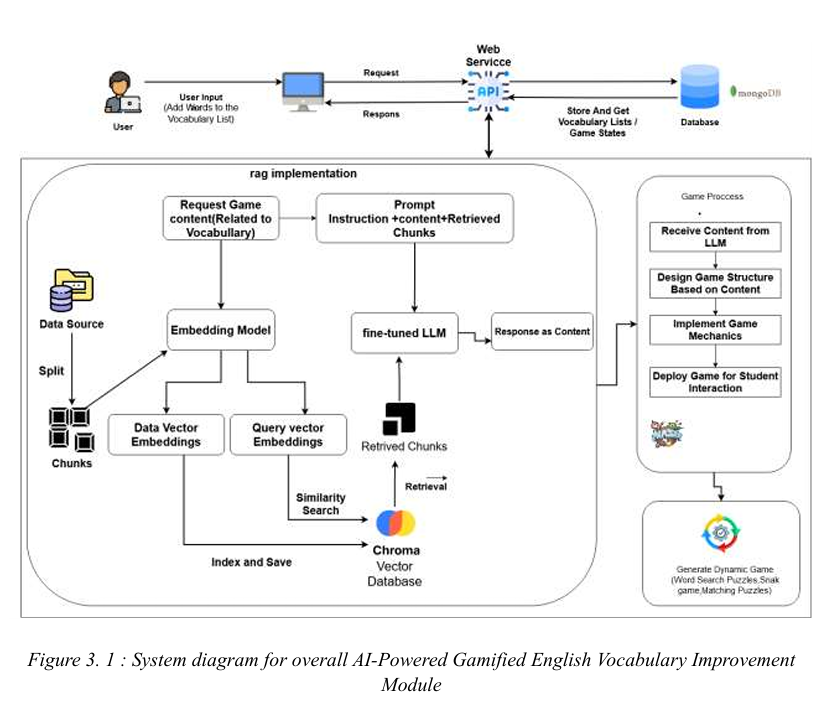

# AI-enabled-Intelligent-Assistant-to-Improve-Reading-and-Comprehension-Skills-in-English-RP24-25J-027

## Contributors Checklist

### **Ranaweera A.P. - IT21182396 (Group Leader)**  
- [ ] Assigned tasks to team members.  
- [ ] Reviewed pull requests and ensured quality code standards.  
- [ ] Maintained project documentation (README, Wiki, etc.).  
- [ ] Led team meetings and discussions.  
- [ ] Ensured deadlines were met.

### **Senanayake W.G.B. - IT21158322**  
- [ ] Developed and tested core backend functionality.  
- [ ] Ensured proper database schema design and implementation.  
- [ ] Created API endpoints and ensured smooth integration.  
- [ ] Handled debugging and resolved technical issues.  
- [ ] Contributed to technical documentation.

### **Sooriyaarachchi M.D.A - IT21173790**  
## System Diagram(AI-Powered Gaming English Vocabulary Improvement Module)

- [ ] Designed and implemented frontend interfaces.  
- [ ] Worked on responsive and user-friendly UI/UX designs.  
- [ ] Conducted cross-browser and device compatibility testing.  
- [ ] Integrated frontend with backend services.  
- [ ] Participated in feedback sessions for UI improvements.

### **Kumarathunga S.A.D.S - IT21118340**  
- [ ] Performed system testing and identified bugs.  
- [ ] Worked on unit and integration testing.  
- [ ] Assisted with deployment and environment setup.  
- [ ] Documented test cases and results.  
- [ ] Supported debugging efforts and issue tracking.

<h3>Contributors:</h3>

- Ranaweera A.P. - IT21182396 (Group Leader)
- Senanayake W.G.B. - IT21158322
- Sooriyaarachchi M.D.A - IT21173790
- Kumarathunga S.A.D.S - IT21118340
